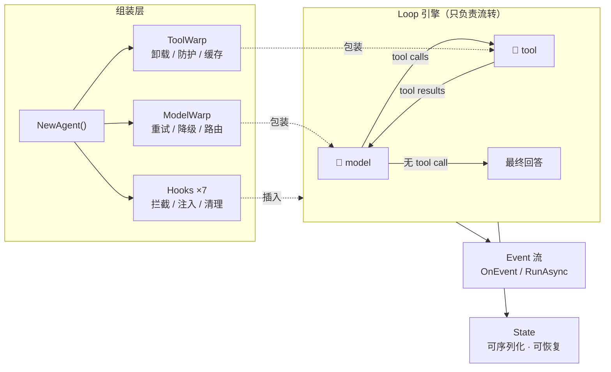

<div align="center">


# ezloop

**简单，不简陋。**

一个 Loop · 两个节点 · 七个钩子 —— 用节点装饰器与流式插件组装任意智能体

[](https://go.dev)
[](https://pkg.go.dev/github.com/xuanlv2002/ezloop)
[](#包结构)
[](#测试)

*model 和 tool 管节点怎么执行，hook 管流程什么时候插入逻辑。*

</div>

---

## 设计理念

大多数 Agent 框架把重试、MCP、审批、日志焊死在引擎里，能力越多，引擎越重。
ezloop 反其道而行：**引擎不理解任何具体能力，它只负责流转。**



整个框架只有三个核心概念：

| 概念 | 关注点 | 扩展方式 |
|---|---|---|
| **model** | 节点本身：模型调用 | 实现 `provider.ModelProvider` + `WithModelWarp` 中间件 |
| **tool** | 节点本身：工具执行 | 实现 `types.Tool` + `WithToolWarp` 中间件 |
| **hook** | 流的前后：生命周期与控制流 | 实现 hook 小接口 + `WithHooks` 插入 |

三条设计原则：

1. **节点与流分离** —— model/tool 是循环的节点，用 Warp 装饰（怎么执行）；
   hook 是循环的切面，按时机插入（什么时候做什么）。两者互不越界。
2. **扩展永不入核** —— 重试是 warp，MCP 是 hook，审批是 hook，会话持久化也是 hook。
   引擎零扩展依赖，不用不引入。
3. **状态即消息** —— loop 的全部状态是 `LoopState`，其中 `Messages` 可序列化、
   可恢复、可直接作为下一轮历史。没有隐藏的内存中间态。

📖 **[完整文档](https://xuanlv2002.github.io/ezloop/)**：核心理念 · Loop 引擎 · 架构全景 · 官方扩展指南 ·
本地 Agent · Web Agent 内核

## 快速开始

```bash
go get github.com/xuanlv2002/ezloop
```

```go
agent := core.NewAgent(p,
    core.WithSystemPrompt("你是一个严谨的助手"),   // agent 级系统提示词
    core.WithModelWarp(modelretry.Warp()),      // model 节点：重试
    core.WithToolWarp(safetool.Warp()),         // tool 节点：panic 防护
    core.WithHooks(mcp.NewHook(mcpCfg)),        // 流：MCP 工具接入
    core.WithStreaming(true),                   // 流式输出
)

// 同步：单轮
state, err := agent.Run(ctx, "帮我读一下 hello.txt")

// 多轮：上一轮的 Messages 直接作为历史
state, err = agent.Run(ctx, "再总结一下", core.WithHistory(state.Messages...))

// 异步：事件通道 + 取消（服务端场景）
h := agent.RunAsync(ctx, "长任务")
defer h.Cancel()
for e := range h.Events() { render(e) }   // loop 结束自动 close
state, err = h.Wait()
```

## 官方扩展

| 扩展 | 类型 | 说明 |
|---|---|---|
| `ext/fs` | 底座 | FileSystem 核心（Read/Write/List）+ 可选能力 Modifier（Edit/ApplyPatch）、Searcher（Grep/Find）；Local 实现全部能力（root 沙箱、补丁预检+回滚） |
| `ext/provider/openai` | model | OpenAI 兼容 Provider（Invoke + SSE 流式），兼容 DeepSeek/SiliconFlow/Ollama/vLLM |
| `ext/warp/model/modelretry` | warp | 模型重试：指数退避，流式仅在未发出 chunk 时重试 |
| `ext/warp/tool/safetool` | warp | 工具防护：panic 恢复 + error 附加上下文 |
| `ext/warp/tool/offload` | warp | 大结果卸载：超阈值写入 FS，上下文只留摘要+路径 |
| `ext/hook/mcp` | hook | mcpRouter 单工具封装（schema 恒定、KV cache 友好、配置热加载），内置官方 go-sdk |
| `ext/hook/skill` | hook | 技能注入：代码定义或从 FS 目录加载 *.md（可选 .keywords） |
| `ext/hook/summary` | hook | loop 结束自动生成摘要写入 Metadata |
| `ext/hook/approve` | hook | 工具审批：channel 决策中断（EventRequest + Decisions 回传） |
| `ext/hook/askuser` | hook | ask_user 工具：模型提问中断等回答，回答作为工具结果入史 |
| `ext/hook/taskplan` | hook | task_plan 工具：规划提交中断等处置（执行/否决/修订） |
| `ext/hook/contextfix` | hook | Run 开始时修理历史：缺失的 tool 结果补占位，序列协议完整 |
| `ext/hook/filetools` | hook | 文件工具集：read_file（行分页）、write、edit、apply_patch、grep、find、bash；按 FS 能力注册，修改走 per-path 队列 |
| `ext/hook/localsession` | hook | 会话持久化：滚动快照到 sessions/<id>.json，Load/List 恢复续聊 |

## 包结构

```
框架层（只含接口与引擎，零扩展依赖）
├── types/      统一结构体 LoopState / Message / Tool + ToolWarp
├── event/      事件定义与 OnEvent 回调
├── hook/       7 个 hook 小接口 + Action 短路语义
├── provider/   ModelProvider / StreamProvider 抽象 + Warp
└── core/       NewAgent 组装 + loop 引擎

扩展层（能力实现，官方 SDK 依赖放这里，不用不引入）
├── ext/provider/openai
├── ext/warp/{model/modelretry, tool/safetool, tool/offload}
├── ext/hook/{mcp,skill,summary,approve,askuser,taskplan,filetools,localsession}
└── examples/chat        # 完整 agent：集成全部能力
```

## 测试

```bash
go test ./...        # 引擎行为 / 短路语义 / 事件顺序 / MCP 全链路 / SSE 聚合
go run ./examples/chat
```

---

<div align="center">

**ezloop** — 简单，但不简陋。

</div>
