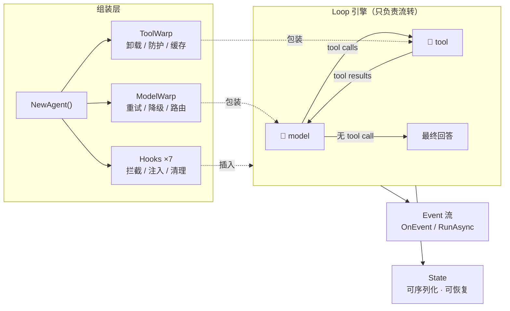
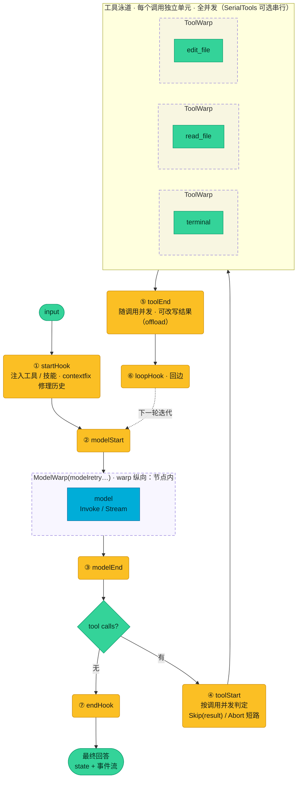
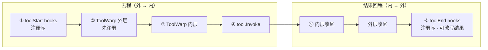
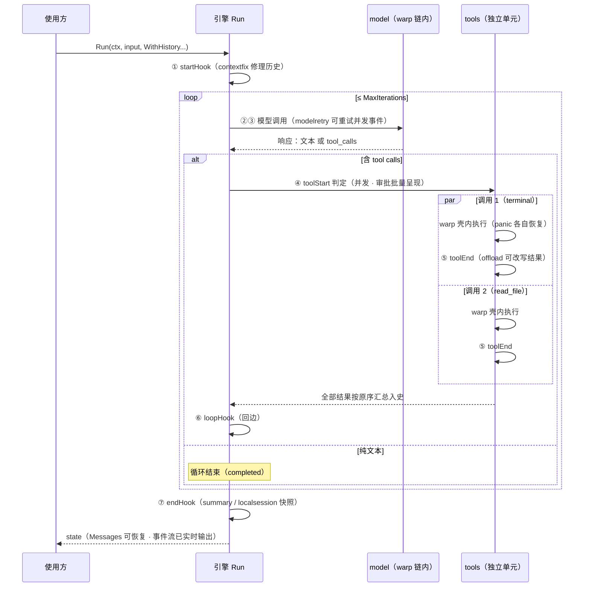

<div align="center">


# ezloop

**简单，不简陋。**

一个 Loop · 两个节点 · 七个钩子 —— 用节点装饰器与流式插件组装任意智能体

[](https://go.dev)
[](https://pkg.go.dev/github.com/xuanlv2002/ezloop)
[](#包结构)
[](#测试)

*model 和 tool 管节点怎么执行，hook 管流程什么时候插入逻辑。*

</div>

---

## 设计理念

大多数 Agent 框架把重试、MCP、审批、日志焊死在引擎里，能力越多，引擎越重。
ezloop 反其道而行：**引擎不理解任何具体能力，它只负责流转。**



整个框架只有三个核心概念：

| 概念 | 关注点 | 扩展方式 |
|---|---|---|
| **model** | 节点本身：模型调用 | 实现 `provider.ModelProvider` + `WithModelWarp` 中间件 |
| **tool** | 节点本身：工具执行 | `types.NewTool` 构造（或手写实现 `types.Tool`）+ `WithToolWarp` 中间件 |
| **hook** | 流的前后：生命周期与控制流 | 实现 hook 小接口 + `WithHooks` 插入 |

三条设计原则：

1. **节点与流分离** —— model/tool 是循环的节点，用 Warp 装饰（怎么执行）；
   hook 是循环的切面，按时机插入（什么时候做什么）。两者互不越界。
2. **扩展永不入核** —— 重试是 warp，MCP 是 hook，审批是 hook，会话持久化也是 hook。
   引擎零扩展依赖，不用不引入。
3. **状态即消息** —— loop 的全部状态是 `LoopState`，其中 `Messages` 可序列化、
   可恢复、可直接作为下一轮历史。没有隐藏的内存中间态。

📖 **[完整文档](https://xuanlv2002.github.io/ezloop/)**：核心理念 · Loop 引擎 · 架构全景 · 官方扩展指南 ·
本地 Agent · Web Agent 内核

## 快速开始

```bash
go get github.com/xuanlv2002/ezloop
```

```go
agent := core.NewAgent(p,
    core.WithSystemPrompt("你是一个严谨的助手"),   // agent 级系统提示词
    core.WithModelWarp(modelretry.Warp()),      // model 节点：重试
    core.WithToolWarp(safetool.Warp()),         // tool 节点：panic 防护
    core.WithHooks(mcp.NewHook(mcpCfg)),        // 流：MCP 工具接入
    core.WithStreaming(true),                   // 流式输出
)

// 同步：单轮
state, err := agent.Run(ctx, "帮我读一下 hello.txt")

// 多轮：上一轮的 Messages 直接作为历史
state, err = agent.Run(ctx, "再总结一下", core.WithHistory(state.Messages...))

// 异步：事件通道 + 取消（服务端场景）
h := agent.RunAsync(ctx, "长任务")
defer h.Cancel()
for e := range h.Events() { render(e) }   // loop 结束自动 close
state, err = h.Wait()
```

## 架构与循环

**架构全景**：warp 是纵向封装（包住节点 = 在节点内部），hook 是横向切面（节点前后），两层平级——`WithToolWarp` 的链会应用到每个工具调用；warp 链在每次 Run 组装，工厂注入 `event.Emitter`（观察出口，不碰 state）。



**执行顺序（洋葱模型：hook 在节点外，warp 在节点内）**——一次工具调用的完整链路：



- 多个 hook（同一作用点）：按注册序，先注册先执行
- 多个 warp：先注册的在外层——请求外 → 内，结果内 → 外（safetool 在外层才能捕获 limit 与本体的 panic）
- hook 永远在 warp 之外：toolStart 先于一切 warp，toolEnd 晚于一切 warp；model 侧同理（modelStart → ModelWarp 链 → provider → modelEnd）
- 同一轮多个调用：各自并发跑完整链；tool_start / tool_end 事件随调用即时发出（到达顺序不保证，以 CallID 关联），消息历史按原序汇总

**一次 Run 的实际循环**：每个工具调用是独立单元（判定 → warp 壳内执行 → toolEnd 后处理整链跟调用走），全部完成后按原始顺序汇总入史——多个人工审批同时呈现，消息历史永远保序、协议完整。



## 事件流

事件只做观察，不用于修改状态（修改状态是 Hook 的职责）。所有事件带
`ForkID` 字段区分归属：空串＝主循环，非空＝对应 fork 分身——消费方据此
把分身的流式输出、审批请求路由到正确的出口。

| 事件 | 时机 | Data |
|---|---|---|
| `loop_start` / `loop_end` | Run 起 / 止 | input / StopReason |
| `model_start` / `model_end` | 模型调用前后 | nil / `*ModelResponse` |
| `model_chunk` / `reasoning_chunk` | 流式正文 / 思考增量 | string |
| `tool_start` / `tool_end` | 工具调用起 / 止（随调用即时，到达序不保证，以 CallID 关联） | `*ToolCall` / `*ToolResult` |
| `iteration_end` | 每轮迭代结束 | int |
| `error` | 引擎错误 | error |
| `stream_fallback` | 声明流式但链上无 StreamProvider，已降级（不静默） | string |

扩展事件自带命名空间前缀（`task.start`、`approve.request`、`askuser.request`、`taskplan.request`…），
人机交互类事件带 CallID，供渲染层呈现并回传决策。

## 官方扩展

| 扩展 | 类型 | 说明 |
|---|---|---|
| `ext/fs` | 底座 | 唯一 FileSystem 接口（Read/Write/List/Edit 四方法）；Local 实现（root 沙箱、查找替换） |
| `ext/provider/openai` | model | OpenAI 兼容 Provider（Invoke + SSE 流式），兼容 DeepSeek/SiliconFlow/Ollama/vLLM |
| `ext/warp/model/modelretry` | warp | 模型重试：指数退避，流式仅在未发出 chunk 时重试（裸用引擎无内置重试，生产建议挂载） |
| `ext/warp/tool/limit` | warp | 工具并发闸：跨全部工具共享信号量，限制一轮 fan-out 的实际并发数，保护外部资源 |
| `ext/warp/tool/safetool` | warp | 工具防护：panic 恢复 + error 附加上下文 |
| `ext/hook/offload` | hook | 大结果卸载：超阈值写入 FS，上下文只留摘要+路径 |
| `ext/hook/mcp` | hook | mcpRouter 单工具封装（schema 恒定、KV cache 友好、配置热加载），内置官方 go-sdk |
| `ext/hook/skill` | hook | 技能注入：代码定义或从 FS 目录加载 *.md（可选 .keywords） |
| `ext/hook/summary` | hook | loop 结束生成摘要写入 Metadata（一次全量历史的模型调用，MinMessages 设阈值跳过短会话；也可不挂 hook 直接调 Summarize 按需触发） |
| `ext/hook/approve` | hook | 工具审批：channel 决策中断（EventRequest + Decisions 回传） |
| `ext/hook/askuser` | hook | ask_user 工具：模型提问中断等回答，回答作为工具结果入史 |
| `ext/hook/taskplan` | hook | task_plan 工具：规划提交中断等处置（执行/否决/修订） |
| `ext/hook/task` | hook | task 工具：并行分身——基于引擎原语 `core.Agent.Fork` 复刻当前 Agent（provider/超参/全部运行期 hook）与上下文快照独立跑子循环，只把最终答案回传主循环（并发、单层；事件与 session 均按 forkID 区分归属，分身写 sessions/<主ID>-<forkID>.json 只存增量（seed 与主 session 重复，剥离）可回放；主 Agent 经 ctx 自动注入，`WithHooks(task.New())` 即可） |
| `ext/hook/contextfix` | hook | Run 开始时修理历史：缺失的 tool 结果补占位，序列协议完整 |
| `ext/hook/filetools` | hook | 文件工具四件套：read_file、write_file、edit_file、terminal（系统原生终端+系统提示注入，建议配 approve）；搜索浏览走 terminal，写操作走 per-path 队列 |
| `ext/hook/localsession` | hook | 会话持久化：滚动快照到 sessions/<id>.json，Load/List 恢复续聊 |

## 包结构

```
框架层（只含接口与引擎，零扩展依赖）
├── types/      统一结构体 LoopState / Message / Tool
├── event/      事件定义与 OnEvent 回调 + ctx 事件出口（warp 层用）
├── hook/       7 个 hook 小接口 + Action 短路语义
├── provider/   ModelProvider / StreamProvider 抽象
├── warp/       节点装饰器统一定义：Handler[T] + Chain + Model/Tool 两类 Handler
└── core/       NewAgent 组装 + loop 引擎 + Fork 派生原语（并行分身）

扩展层（能力实现，官方 SDK 依赖放这里，不用不引入）
├── ext/provider/openai
├── ext/warp/{model/modelretry, tool/safetool}
├── ext/hook/{mcp,skill,summary,approve,askuser,taskplan,task,contextfix,offload,filetools,localsession}
└── examples/chat        # 完整 agent：集成全部能力
```

## 测试

```bash
go test ./...        # 引擎行为 / 短路语义 / 事件顺序 / MCP 全链路 / SSE 聚合
go run ./examples/chat
```

## 贡献者文档

面向扩展开发者的深度参考（架构与文件说明 / 开发规范 / 事件与上下文管理）：

- [docs/dev/architecture.md](docs/dev/architecture.md) — 基础架构 · 文件说明
- [docs/dev/conventions.md](docs/dev/conventions.md) — 开发规范（注释 / 错误 / 并发 / 缓存 / 测试）
- [docs/dev/lifecycle.md](docs/dev/lifecycle.md) — 事件与上下文管理（本地 / 多租户）

---

<div align="center">

**ezloop** — 简单，但不简陋。

</div>
