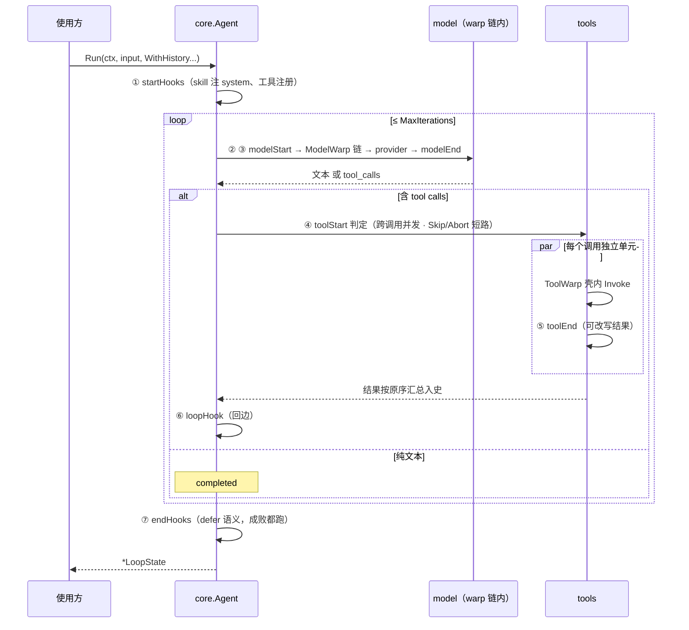

# ezloop 基础架构与文件说明

面向贡献者的架构参考。开发规范见 [conventions.md](conventions.md)，事件与上下文管理见 [lifecycle.md](lifecycle.md)。

## 分层模型

```
框架层（只含接口与引擎，零第三方依赖，不用不引入）
├── types/      统一结构体 LoopState / Message / Tool / Usage
├── event/      事件定义、OnEvent 回调、Emitter 最小出口
├── hook/       7 个 hook 小接口 + Action 短路语义
├── provider/   ModelProvider / StreamProvider 抽象
├── warp/       节点装饰器统一定义：Handler[T] + Chain + Model/Tool 两类
└── core/       NewAgent 组装 + loop 引擎 + Fork 派生原语

扩展层（能力实现，官方 SDK 依赖放这里）
├── ext/fs                  文件系统抽象（Local 沙箱实现）
├── ext/provider/openai     OpenAI 兼容 Provider（Invoke + SSE 流式）
├── ext/warp/model/modelretry   模型重试
├── ext/warp/tool/{limit,safetool}  工具并发闸 / panic 防护
├── ext/hook/*              11 个能力 hook（见下表）
└── examples/{chat,provider}
```

**依赖方向规则（不可破坏）：**

- core 永不 import ext——引擎不理解任何具体能力，只负责流转
- 框架层内部无环：warp → provider → types；core → {types, event, hook, provider, warp}
- ext 之间尽量正交；确实需要共享的基建放 ext/fs 或 ext/hook/internal/await
- 第三方依赖（官方 SDK 等）一律只出现在 ext/ 下

## 三个核心概念

| 概念 | 关注点 | 扩展方式 |
|---|---|---|
| **model** | 节点本身：模型调用 | 实现 `provider.ModelProvider` + `WithModelWarp` 装饰 |
| **tool** | 节点本身：工具执行 | 实现 `types.Tool` + `WithToolWarp` 装饰 |
| **hook** | 流的前后：生命周期与控制流 | 实现 hook 小接口 + `WithHooks` 插入 |

**warp = 纵向封装（节点内部，不碰 state），hook = 横向切面（节点前后，拿 state）**，两层平级。判断新能力放哪：管"节点怎么执行"是 warp，管"流程什么时候插入逻辑"是 hook。

## Loop 引擎执行流程



关键不变量：

1. **历史协议完整**：任何退出路径（完成/skip/abort/hook 错误/取消）下，每个 tool_call 必有对应的 tool 结果消息。contextfix hook 在 OnStart 兜底修理外部带入的破损历史。
2. **组装期与运行期分离**：startHooks 是组装期（Run 一次性跑，产物进 state），其余六类 hook 是运行期（循环节点前后反复跑）。Fork 派生时跳过组装期、全继承运行期。
3. **Agent 构建后只读**：NewAgent 返回后 Agent 不可变（框架契约），因此浅拷贝复刻安全、多 goroutine 共享同一 Agent 并发 Run 安全。

### 工具执行模型

每个调用是独立单元：toolStart 判定 → warp 壳内执行 → toolEnd 后处理，整链跟调用走。同一轮多个调用**默认全并发**（调用数即并发数，限流自己做 warp 信号量如 ext/warp/tool/limit）；`HyperParams.SerialTools` 可选串行。

- tool_start / tool_end 事件随调用即时发出，到达顺序不保证——顺序不是可靠性，CallID 才是；消息历史按原序汇总
- OnToolStart / OnToolEnd 跨调用并发（单调用内多个 hook 仍按注册序串行）——多个人工审批同时呈现
- 洋葱模型：toolStart 先于一切 warp，toolEnd 晚于一切 warp；多个 warp 先注册的在外层（safetool 要捕获 limit 与本体的 panic，须注册在 limit 之前）

## 文件说明（逐包）

### 框架层

| 包 | 关键文件 | 职责与公开面 |
|---|---|---|
| types | `state.go` `message.go` `model.go` `tool.go` | `LoopState`（Input/Messages/Tools/Usage/ForkID/SeedLen/Metadata/Emitter…）、`Message`（含 Reasoning/ToolCalls/Err）、`ModelRequest/ModelResponse/ModelChunk`、`Tool` 接口与 `ToolRegistry`（map 存储、同名覆盖、List 按名排序＝集合的确定函数） |
| event | `event.go` | `Event{Type,Timestamp,Iteration,ForkID,Data}`、全部引擎事件类型常量、`OnEvent`、`Emitter`（warp 层最小观察出口）、`Noop` |
| hook | `hook.go` | `Hook` 基接口（Name）+ 七个时机接口（Start/ModelStart/ModelEnd/ToolStart/ToolEnd/Loop/End）、`Action{Kind,Result}` 与 `Proceed/Abort/Skip` |
| provider | `provider.go` | `ModelProvider.Invoke`、`StreamProvider.Stream`（可选实现，WithStreaming 时优先） |
| warp | `warp.go` | `Handler[T](em, node) T`、`Chain`（先注册在外层）、`ModelHandler/Model`、`ToolHandler/Tool` |
| core | `agent.go` `loop.go` `fork.go` | `NewAgent` + 全部 `Option`/`RunOption`、`AgentFromContext`（Run 时注入自身）、loop 引擎本体、`Agent.Fork`（通用派生原语） |

### 扩展层

| 包 | 类型 | 职责要点 |
|---|---|---|
| ext/fs | 底座 | FileSystem/Modifier/Searcher 能力接口 + Local 实现（root 沙箱、补丁预检+回滚） |
| ext/provider/openai | model | OpenAI 兼容协议；双缓存字段解析（cached_tokens/prompt_cache_hit_tokens）、reasoning 仅响应侧、HTTPError.Retryable 与 modelretry 解耦契约 |
| ext/warp/model/modelretry | warp | 指数退避；流式仅未发出 chunk 时可重试；RetryIf 可定制 |
| ext/warp/tool/limit | warp | 跨全部工具共享的信号量并发闸 |
| ext/warp/tool/safetool | warp | panic 恢复 + error 附加上下文（注册在 limit 外层） |
| ext/hook/mcp | hook | mcpRouter 单工具封装：schema 恒定（KV cache 友好）、配置热加载 |
| ext/hook/skill | hook | 技能注入：拼接到唯一 system 消息（全程单条 system，不滚雪球） |
| ext/hook/summary | hook | 会话摘要：Options 阈值跳过短会话；也可直接调 Summarize 按需触发 |
| ext/hook/approve | hook | 工具审批：channel 决策中断（EventRequest + Decision 回传） |
| ext/hook/askuser | hook | 模型提问中断等回答，回答作为工具结果入史 |
| ext/hook/taskplan | hook | 规划提交中断等处置（执行/否决/修订） |
| ext/hook/task | hook | 并行分身：拦截 task 调用 → core.Fork 隔离子循环 → Skip 回传最终答案 |
| ext/hook/contextfix | hook | OnStart 修理历史：补缺失 tool 结果、删孤儿 tool 消息 |
| ext/hook/offload | hook | 大结果卸载：超阈值写 FS，上下文只留摘要+路径（文件名＝工具名+内容联合哈希） |
| ext/hook/filetools | hook | 文件工具集：按 FS 能力注册，修改走 per-path 队列 |
| ext/hook/localsession | hook | 会话持久化：滚动快照；分身（ForkID 非空）写独立文件且只存增量（SeedLen 剥离） |
| ext/hook/internal/await | 内部 | 决策 Router：按 CallID 路由 + 错配暂存 + close 广播重查（共享决策 channel 并发等待的正解） |

## Fork 派生原语（core/fork.go）

`Fork(ctx, forkID, seed, tools, input)` 复刻当前 Agent 跑一次隔离子循环：

- **只在 core 实现**：跳过组装期需要触碰私有字段（startHooks/toolWarps/systemPrompt），扩展层做不到
- 只 `startHooks=nil`（组装期不重跑，产物已在 seed/tools 中）；运行期 hook 全继承——审批无旁路、分身可问用户
- seed 深拷贝防并行踩踏；`state.ForkID`（事件与持久化归属）+ `state.SeedLen`（持久化剥离边界）由引擎结构性填写
- ext/hook/task 是第一个使用者；任何"以当前自我为模板跑隔离循环"的场景（评审、假设分支、重跑验证）都可复用
